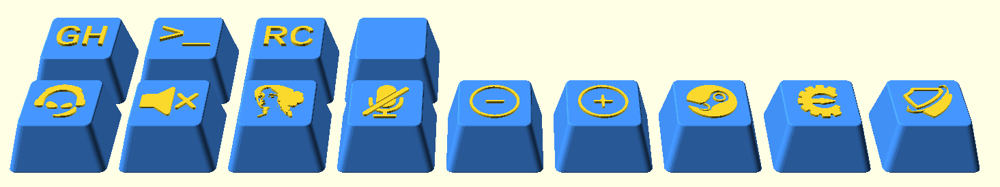
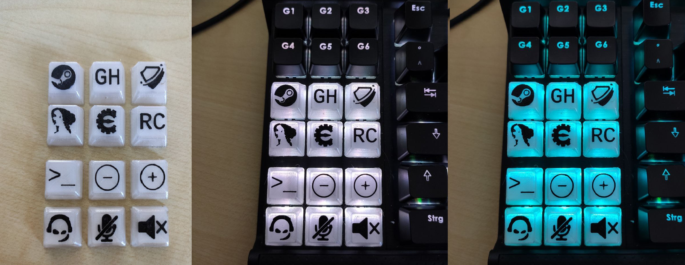

# key_caps

## Install
- http://www.openscad.org/downloads.html
- git clone https://github.com/rsheldiii/openSCAD-projects.git
- git clone https://github.com/multikill/key_caps
- cp key_caps/* openSCAD-projects/key/ -r -f
- Open files for editing with OpenScad
1. Single Key: .\openSCAD-projects\key\a_single_key.scad
2. Multiple Keys: .\openSCAD-projects\key\a_multiple_keys.scad

## Credits
- rsheldiii for Keycap generator https://www.thingiverse.com/thing:2783650
- selva image to .stl http://app.selva3d.com/signin
